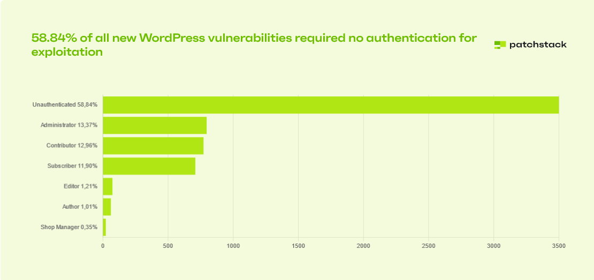

## Why WordPress Hacking?

Targeting WordPress sites as a medium to get into the server is a prevalent thing that has been happening for a very long time. The primary reason for targeting WordPress is its extensive market share and the huge ecosystem.

The WordPress core has been reviewed over a very long period by thousands of developers and researchers. As a result, it is difficult for attackers to break into. However, in comparison to the core, plugins, and themes used on sites present easier targets for attackers due to fewer code reviews and security checks. A sophisticated attacker can review the code of a plugin and find critical security vulnerabilities to take over the whole plugin if it has not already been well security-tested.

WordPress plugins & themes as a weak link in the supply chain are very prevalent due to how neglected the security is for the plugins and themes.

## Patchstack Mission

One of the objectives of **Patchstack Academy** is to enhance readers' understanding of WordPress security in a white-box/code-review approach. We have selected the white-box method for learning because WordPress is open-source, making its source code readily accessible. This approach ensures that readers gain a deeper understanding of how vulnerabilities can emerge and be fixed at the code level.

## Vulnerability Statistics

According to our [State of WordPress Security in 2024](https://patchstack.com/whitepaper/state-of-wordpress-security-in-2024) whitepaper, a total of 5948 vulnerabilities were added to the Patchstack DB, out of which almost 97% vulnerabilities were found in the plugins. The core only had 13 vulnerabilities fixed out of which there were no significant exploitable scenarios.

These statistics highlight that attackers primarily target plugins, given that most vulnerabilities are found there.

With plugins being the primary target, the requirement for authentication is another important factor that comes into play for any vulnerability to be exploited. The less the privilege required, the higher the chance of exploitation. In the real-world scenario, the most exploited vulnerabilities are the ones that require no authentication.

The above statistics show that almost 59% of the plugins require no authentication for exploitation, making a huge amount of vulnerabilities highly prone to exploitation by malicious threat actors.

Analyzing the vulnerabilities that were the most attempted exploitation in the wild, all of them are unauthenticated ones as can be seen in the [whitepaper](https://patchstack.com/whitepaper/state-of-wordpress-security-in-2024#headline-1007-17052).

## Conclusion

With the given statistics, we can conclude that WordPress hacking is a persistent and significant threat landscape, largely driven by the vulnerabilities present in plugins and themes. Attackers leverage these weak points in the WordPress ecosystem, exploiting gaps in security measures to compromise websites.

It is crucial to protect open-source plugins and themes from being exploited by malicious hackers which is what we are doing at Patchstack.